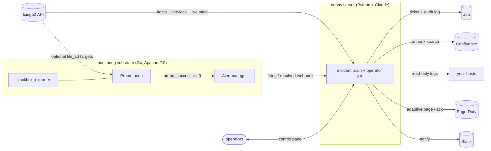

<div align="center">

```
  ███╗   ██╗  █████╗  ███╗   ██╗ ███╗   ██╗ ██╗   ██╗
  ████╗  ██║ ██╔══██╗ ████╗  ██║ ████╗  ██║ ╚██╗ ██╔╝
  ██╔██╗ ██║ ███████║ ██╔██╗ ██║ ██╔██╗ ██║  ╚████╔╝
  ██║╚██╗██║ ██╔══██║ ██║╚██╗██║ ██║╚██╗██║   ╚██╔╝
  ██║ ╚████║ ██║  ██║ ██║ ╚████║ ██║ ╚████║    ██║
  ╚═╝  ╚═══╝ ╚═╝  ╚═╝ ╚═╝  ╚═══╝ ╚═╝  ╚═══╝    ╚═╝
```

### 🤖 your on-call shift, automated — and audited

**Discover → monitor → triage → adaptively page → resolve → report.** A supervised, self-documenting on-call agent that watches your fleet, investigates incidents like a teammate, and only wakes a human when it actually should.


</div>

---

## 💡 What it is

nanny pairs an **LLM triage brain** with a **boring, proven monitoring substrate**. Prometheus and Alertmanager handle detection and routing; nanny handles the judgment — opening tickets, reading runbooks and logs, forming a hypothesis, deciding *whether and when* to page, and writing down everything it did. Operators watch and act through a shared, multi-user control panel.

> **The thesis:** detection is a solved problem — adopt it. Judgment, documentation, and "should this actually wake someone?" are where an agent earns its keep.

The brain is configurable: **cloud Claude** (default), a **local OpenAI-compatible model** (fully offline), or **no LLM at all** (`NANNY_LLM_BACKEND=none`) — which still tickets, holds and pages, but gathers evidence deterministically (live Icinga state, runbook, prior incidents, self-resolve history) instead of reasoning, at zero token cost.

---

## ✨ Highlights

- 🔎 **Icinga-sourced fleet** — pulls hosts, services, and **live state** straight from your Icinga2 API; no re-probing. (A TCP-connect network scan of *your* ranges is still available as a fallback source.)
- 🗂️ **Rich fleet view** — grouped by host, with real OK/WARN/CRIT/UNKNOWN severity, the **plugin output** + perf data, time-in-state, **notes**, and **downtime / ack** status. Searchable, status-filterable, and paginated; click a check to expand full detail.
- 🩺 **Probing + alerting** that scales — Prometheus + blackbox_exporter do the checks; you're not hand-rolling a scheduler.
- 🧠 **Automated triage** — searches Confluence runbooks, hunts prior Jira incidents, reads logs, and proposes probable cause + fixes.
- 📒 **Audit-first** — every action nanny takes lands on the incident ticket as a timestamped log. Nothing happens off the record.
- ⏳ **Adaptive paging** — alerts that *historically self-resolve* are held longer before paging, so on-call isn't woken for things that clear themselves.
- 🎫 **Full ticket lifecycle** — opens a Jira ticket per incident and **auto-closes** the ones that self-resolve.
- 👥 **Multi-operator control panel** — shared incident state, a live online-operator roster, and conflict-free claim/ack.
- 🔒 **Least-privilege by design** — log access is a locked-down, read-only, forced-command SSH account; the model never gets a shell.
- 📊 **Shift reports** — counts, MTTR, paged-vs-self-resolved, by-service breakdowns.

---

## 🏗️ Architecture



Two workloads, two languages — on purpose. The **brain** (triage, tickets, decisions) is Python for SDK ergonomics; the **substrate** (probing, routing) is the Go-based Prometheus stack. nanny is the smart layer on top of a dependable base.

---

## 🚀 Quickstart

```bash
# 1. Build the all-in-one image (nanny + Prometheus + Alertmanager + blackbox_exporter)
podman build -t nanny:bundle -f Containerfile.bundle .

# 2. Configure
cp nanny.env.example nanny.env   # then fill it in

# 3. Verify every integration is reachable
podman run --rm --env-file ./nanny.env nanny:bundle selftest

# 4. Inventory your fleet from Icinga (set ICINGA_API_URL/USER/PASSWORD in nanny.env).
#    With Icinga configured, `discover` reads hosts/services + live state from its
#    API; the server's fleet view then reads Icinga directly.
#    A named volume is simplest: Podman creates it with the right ownership, and
#    the discover run + the server share it.
podman run --rm --env-file ./nanny.env -v nanny-data:/data \
  nanny:bundle discover
#    Prefer a network scan instead? `discover --source cidr --cidr 10.0.1.0/24`

# 5. Run the whole stack (same volume holds targets, TSDB, history)
podman run -d --name nanny --env-file ./nanny.env \
  -p 9099:9099 \
  -v nanny-data:/data \
  -v ~/.ssh/nanny_key:/run/secrets/nanny_key:ro,Z \
  nanny:bundle

# Prefer the data on the host instead of a named volume? Create the dir first
# (Podman won't auto-create a bind-mount source) and use ./data with :Z :
#   mkdir -p ./data
#   ... -v ./data:/data:Z ...
# The entrypoint fixes ./data's ownership for the nanny user at startup.

# 6. Operators connect their control panel
NANNY_SERVER_URL=http://nanny-host:9099 NANNY_OPERATOR="Viktor" \
  podman run --rm -it --env-file ./nanny.env nanny:bundle panel
```

---

## 🧭 Modes

| Mode | What it does |
|------|--------------|
| `server` | **Always-on backend** — Alertmanager webhook + operator API + shared incident state. *(the bundle's default)* |
| `panel` | **Operator control panel** — shared incidents, online-operator roster, claim/ack. |
| `discover` | Inventory the fleet from the Icinga2 API (or `--source cidr` to scan your CIDRs); generate monitors + Prometheus targets. |
| `monitor` | Standalone checker with retry backoff + escalation (when not using the bundle). |
| `tui` | Live read-only console: dashboard / fleet / incidents / reports / settings / about. |
| `shell` | Conversational REPL — talk to the triage agent directly. |
| `selftest` | Probe every integration (Anthropic, Slack, Confluence, Jira, PagerDuty, Icinga, SSH) — exits non-zero on failure, so it gates a deploy. The same per-integration probes are also one-click buttons in the web console's **controls** tab. |
| `report` | Shift report from the incident log (`--since 8h`). |
| `install` / `uninstall` | Provision / remove the read-only log account on a host. |
| `run` | Legacy Slack-PagerDuty watcher (Socket Mode). |

---

## 🎛️ The control panel

```
nanny control panel  ·  Viktor  ·  incidents          nanny-host:9099 · 3 online

 #  severity  summary                  service  owner   ack  age   ticket
 1  critical  api 5xx spike on web-01   api      Sam     ✓    142s  OPS-481
 2  warning   disk 82% on db-01         db       —       —     63s  OPS-482

[i]ncidents [o]perators [d]ash · 1-9 select · [c]laim [k]ack [x]release · [q]uit
```

Multiple operators run `panel` against one `server`. It registers presence (heartbeats every 10s), shows who else is online, and lets you claim and ack incidents. **Claiming or acking during the paging hold suppresses the auto-page** — nanny sees a human is on it.

The web console's **dashboard** auto-refreshes in place (no flicker or scroll-jump) and its counter cards are **clickable** — a click drops you straight into the matching view with the filter pre-set (e.g. *critical* → fleet filtered to crits, *firing now* → incidents, *online* → operators). A header spinner animates only while nanny is actually working (an operator action in flight, or the server mid-triage / running a job).

The **triage** tab is the operator's working surface: firing incidents ordered paged→holding, each expanding to show **live Icinga state** for the host (is the whole box down or just one check?), the **runbook** link, nanny's triage analysis + the audit trail of what it did, and explicit action buttons (claim / ack / release / open runbook / open ticket / view host in fleet). The triage agent itself can now pull live Icinga state (`get_icinga_state`) and is handed the service's runbook `notes_url` up front.

---

## 🗂️ The fleet view

The web console's **fleet** tab renders Icinga's live state, **grouped by host**:

```
576 hosts · 4714 checks · 18 not OK          [ filter… ] [ problems ▾ ] [ 25 hosts ▾ ]

● DOWN  10.3.28.114  hadoop-07            DOWNTIME            2 CRIT · 1 WARN · 0 OK
        ● CRIT  ping4    PING CRITICAL - Packet loss = 100%            12m  ▸
        ● CRIT  ssh      CRITICAL - Connection refused                 12m  ▸
● UP    10.4.6.6     pdu-1720             1 WARN · 1 OK
        ● WARN  apc_30amp  WARNING - load 26A/30A                       2h  ▾
          ┊ perf: current=26;30;32   cmd: check_apc   last: 41s ago
          ┊ acked: no   downtime: no   notes: Office PDU in 1720-001
```

Each check shows its real **OK/WARN/CRIT/UNKNOWN** severity, the **plugin output**, time-in-state, and **DOWNTIME / ACK / SOFT** chips; host headers carry host state, a severity roll-up, host **notes**, and any active downtime (author, comment, until). Search matches host/service/output/notes; the status filter narrows to problems/crit/warn/unknown/in-downtime/acknowledged; results paginate by host. Click any check to expand full output, perf data, command, freshness, and downtime detail. `/api/fleet` is cached (`NANNY_FLEET_TTL`, default 15s) so the 2.5s console refresh doesn't hammer Icinga.

---

## 🛡️ How the clever bits work

**Adaptive paging.** Every resolved incident records whether it cleared on its own and how fast. When an alert fires, nanny looks up that signature's history: if it reliably self-resolves, the page is held for ~p90 of past self-resolve times (capped) instead of the default. Things that always need a human page on the default delay; things that flap and recover get room to do so.

**Idempotent ack & work** *(survives multiple operators + retries)*:
- **Incident identity** = the Alertmanager fingerprint → a re-fired alert never opens a second ticket or re-runs triage.
- **Claim** = single-owner compare-and-set under a lock → one winner, everyone else gets the current owner.
- **Ack** = a per-click idempotency key + an `acked` flag captured under the lock → the PagerDuty ack fires **exactly once**, no matter how many operators or double-clicks hit it.

**Audit-first triage.** The triage agent's every tool call — runbook searched, host logs read, prior tickets found — is captured with timestamps and written to the incident ticket alongside the analysis. The ticket *is* the audit trail.

---

## 🔒 Security notes

- **Log access is read-only and locked down.** `install` provisions a passwordless SSH service account pinned to a forced-command wrapper that can only read allow-listed log files. The model never composes a shell command.
- **Fleet inventory is read-only.** The default source is the Icinga2 API (an API user with read permission on objects). The optional `--source cidr` scan is plain TCP-connect asset inventory scoped to ranges you name — no exploitation, no credentials.
- **Authentication is always required.** A session (256-bit bearer token, sent in the `Authorization` header — never the URL — expiring after 30 min idle / 12 h absolute) is needed for **every** `/api/*` endpoint, reads included. Choose the credential with one of: **LDAP/AD** (`NANNY_LDAP_URL`, optional group gate `NANNY_LDAP_GROUP`); a **shared console password** (`NANNY_AUTH_PASSWORD`); or explicit **name-only** access (`NANNY_AUTH_INSECURE=true`, which logs a loud warning — keep strictly behind your VPN). With none set, logins are refused (fail closed). Logout (`/api/logout`) and 15-min idle auto-logout invalidate the session.
- **License attribution** is vendored into `/licenses` in the image (Apache-2.0 `NOTICE`/`LICENSE` for each bundled binary).

---

## ⚙️ Configuration

All configuration is environment variables — see [`nanny.env.example`](./nanny.env.example) for the annotated list. The `settings` view in `nanny tui` shows what's set (secrets masked) at a glance.

**Icinga (fleet source of truth):**

| Variable | Purpose |
|----------|---------|
| `ICINGA_API_URL` | Base URL incl. port, e.g. `https://icinga01.example.net:5665`. Setting it makes `discover` and the fleet view use Icinga. |
| `ICINGA_API_USER` / `ICINGA_API_PASSWORD` | An Icinga2 **`ApiUser`** (not an Icinga Web 2 / LDAP login) with `objects/query/Host`, `objects/query/Service`, `status/query`. |
| `ICINGA_API_CA` | Path to the CA bundle that signed Icinga's API cert (for verified TLS). |
| `ICINGA_INSECURE` | Skip TLS verification — Icinga's API cert is self-signed by default. |
| `ICINGA_LEGACY_TLS` | Lower the TLS floor (min TLSv1, cipher SECLEVEL 0) so a modern OpenSSL can talk to **ancient Icinga (≤2.x)**; leave unset for modern installs. |
| `ICINGA_RETRIES` | Retries for transient connection failures (default 4); auth errors aren't retried. |
| `NANNY_FLEET_TTL` | Seconds to cache the fleet snapshot the console polls (default 15). |

> The Icinga2 REST API authenticates only against `ApiUser` objects (in `api-users.conf`) or client certs — **not** personal/web logins. Define one with read permission on Host/Service/status before pointing nanny at it.

**Web console auth (optional LDAP / AD):**

| Variable | Purpose |
|----------|---------|
| `NANNY_LDAP_URL` | LDAP server, e.g. `ldaps://ldap.corp.net`. Setting it turns on auth — operators bind with their own credentials. Requires `ldap3` (in the bundle image). |
| `NANNY_LDAP_DOMAIN` | AD UPN style: the typed username binds as `user@domain`. |
| `NANNY_LDAP_BIND_DN_TEMPLATE` | Alternative to domain — a DN template where `{user}` is substituted, e.g. `uid={user},ou=people,dc=corp,dc=net`. |
| `NANNY_LDAP_BASE_DN` / `NANNY_LDAP_LOGIN_ATTR` | Base DN + login attribute (`sAMAccountName` for AD, `uid` for OpenLDAP) to resolve a display name and check groups. |
| `NANNY_LDAP_GROUP` | Require this group (substring-matched against `memberOf`) — non-members are denied. |
| `NANNY_LDAP_STARTTLS` / `NANNY_LDAP_INSECURE` | StartTLS on a plain connection / skip cert validation for self-signed certs. |

---

## 🧱 Tech stack

| Layer | Tech |
|-------|------|
| Brain | Python 3.12 · Anthropic Claude · `rich` TUI |
| Substrate | Prometheus · Alertmanager · blackbox_exporter *(all Apache-2.0)* |
| Fleet source | Icinga2 REST API *(or a TCP-connect network scan)* |
| Integrations | Jira & Confluence Cloud · PagerDuty · Slack |
| Packaging | Podman / OCI · supervisord · tini |

---

## 📜 License

nanny's own source is licensed under the **Business Source License 1.1** (BSL 1.1) — see [`LICENSE`](./LICENSE). You may copy, modify, and self-host it, including in production, **except** offering it to third parties as a hosted/managed on-call, monitoring, alerting, or incident-triage service (a "nanny Service") — that needs a separate commercial license. Four years after each version is published it converts to **Apache-2.0**. BSL 1.1 is source-available, not an OSI open-source license.

The bundled monitoring binaries (Prometheus, Alertmanager, blackbox_exporter) remain under their own **Apache-2.0** licenses, vendored into `/licenses` in the image.

---

## 🙌 Author

**Viktor** — Director of Operations, DomainTools
🔗 [LinkedIn](https://www.linkedin.com/in/your-handle) <!-- swap in your real handle -->

> Built as a supervised, audited approach to on-call automation. Same credit lives in the `about` view of `nanny tui`.

---

<div align="center">
<sub>nanny keeps watch so your on-call can sleep — and writes down everything it did.</sub>
</div>
